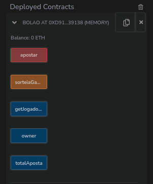

# Contrato de aposta simples

## Resumo:

- O objetivo desse contrato é simular um "bolão" de maneira que, diferentes usuarios/endereços podem apostar um valor e ao final do sorteio, o endereço escolhido ganha todo o montante acumulado.


## tecnologias envolvidas
```
ide: Remix
linguagem: Solidity
```

### Menu de funções no remix:
<br>

